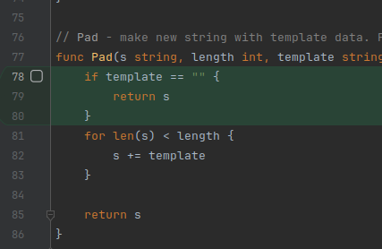

```text
go@linux:~/GolandProjects/rebrain-go/src/Basics-07/01_task$ go test -cover ./internal/pkg/util
ok      module06/internal/pkg/util      (cached)        coverage: 70.6% of statements
```

```text
go@linux:~/GolandProjects/rebrain-go/src/Basics-07/01_task$ go test -cover ./...
        module06/cmd/app                coverage: 0.0% of statements
        module06/internal/app/handlers/hello            coverage: 0.0% of statements
        module06/internal/app/processors/counter                coverage: 0.0% of statements
        module06/internal/app/services/post             coverage: 0.0% of statements
ok      module06/internal/pkg/util      (cached)        coverage: 70.6% of statements
```

Coverage profile
```go test -coverprofile=profile.out ./...```

Analysis of coverage by each function:
```text
go@linux:~/GolandProjects/rebrain-go/src/Basics-07/01_task$ go tool cover -func=profile.out
module06/cmd/app/main.go:8:                                     main                    0.0%
module06/internal/app/handlers/hello/hello.go:15:               Handler                 0.0%
module06/internal/app/processors/counter/post_counter.go:6:     PostCount               0.0%
module06/internal/app/services/post/client.go:21:               NewClient               0.0%
module06/internal/app/services/post/client.go:25:               GetList                 0.0%
module06/internal/pkg/util/util.go:8:                           ReverseInt              100.0%
module06/internal/pkg/util/util.go:28:                          ContainsDuplicate       100.0%
module06/internal/pkg/util/util.go:42:                          IsPalindrome            100.0%
module06/internal/pkg/util/util.go:58:                          Fib                     0.0%
module06/internal/pkg/util/util.go:67:                          MakeSlice               0.0%
module06/internal/pkg/util/util.go:77:                          Pad                     0.0%
total:                                                          (statements)            40.7%
```

Show as HTML in browser
```bash
go tool cover -html=profile.out
```


---

## After additional tests
```text
go@linux:~/GolandProjects/rebrain-go/src/Basics-07/01_task$ go test -coverprofile=profile.out ./internal/app/processors/counter ./internal/pkg/util
ok      module06/internal/app/processors/counter        0.005s  coverage: 100.0% of statements
```

It causes a freeze. Too many goroutines?

```text
go test -timeout 10s -coverprofile=profile.out ./internal/pkg/util
coverage: 100.0% of statements
panic: test timed out after 10s
        running tests:
                TestPad/empty_template (10s)   <---- Infinite Loop!
...
FAIL    module06/internal/pkg/util      10.015s
FAIL
```

Fixing



---

```bash
go@linux:~/GolandProjects/rebrain-go/src/Basics-07/01_task$ go test ./...
?       module06/cmd/app        [no test files]
?       module06/internal/app/handlers/hello    [no test files]
ok      module06/internal/app/processors/counter        (cached)
?       module06/internal/app/services/post     [no test files]
ok      module06/internal/pkg/util      0.005s
?       module06/test/gomock/mocks/postmock     [no test files]
```

Updated coverage profile:

```bash
go@linux:~/GolandProjects/rebrain-go/src/Basics-07/01_task$ go test -cover ./...
        module06/cmd/app                coverage: 0.0% of statements
        module06/internal/app/handlers/hello            coverage: 0.0% of statements
ok      module06/internal/app/processors/counter        0.005s  coverage: 100.0% of statements <--- Merged from 02_task branch
        module06/internal/app/services/post             coverage: 0.0% of statements
ok      module06/internal/pkg/util      0.007s  coverage: 100.0% of statements <--- Plus 30% coverage because of new tests
        module06/test/gomock/mocks/postmock             coverage: 0.0% of statements
```

```go test -coverprofile=profile.out ./...```

```bash
go tool cover -html=profile.out
```