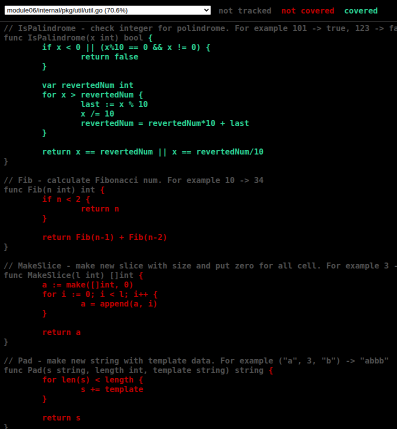

```text
go@linux:~/GolandProjects/rebrain-go/src/Basics-07/01_task$ go test -cover ./internal/pkg/util
ok      module06/internal/pkg/util      (cached)        coverage: 70.6% of statements
```

```text
go@linux:~/GolandProjects/rebrain-go/src/Basics-07/01_task$ go test -cover ./...
        module06/cmd/app                coverage: 0.0% of statements
        module06/internal/app/handlers/hello            coverage: 0.0% of statements
        module06/internal/app/processors/counter                coverage: 0.0% of statements
        module06/internal/app/services/post             coverage: 0.0% of statements
ok      module06/internal/pkg/util      (cached)        coverage: 70.6% of statements
```

Coverage profile
```go test -coverprofile=profile.out ./...```

Analysis of coverage by each function:
```text
go@linux:~/GolandProjects/rebrain-go/src/Basics-07/01_task$ go tool cover -func=profile.out
module06/cmd/app/main.go:8:                                     main                    0.0%
module06/internal/app/handlers/hello/hello.go:15:               Handler                 0.0%
module06/internal/app/processors/counter/post_counter.go:6:     PostCount               0.0%
module06/internal/app/services/post/client.go:21:               NewClient               0.0%
module06/internal/app/services/post/client.go:25:               GetList                 0.0%
module06/internal/pkg/util/util.go:8:                           ReverseInt              100.0%
module06/internal/pkg/util/util.go:28:                          ContainsDuplicate       100.0%
module06/internal/pkg/util/util.go:42:                          IsPalindrome            100.0%
module06/internal/pkg/util/util.go:58:                          Fib                     0.0%
module06/internal/pkg/util/util.go:67:                          MakeSlice               0.0%
module06/internal/pkg/util/util.go:77:                          Pad                     0.0%
total:                                                          (statements)            40.7%
```

Show as HTML in browser
```bash
go tool cover -html=profile.out
```


