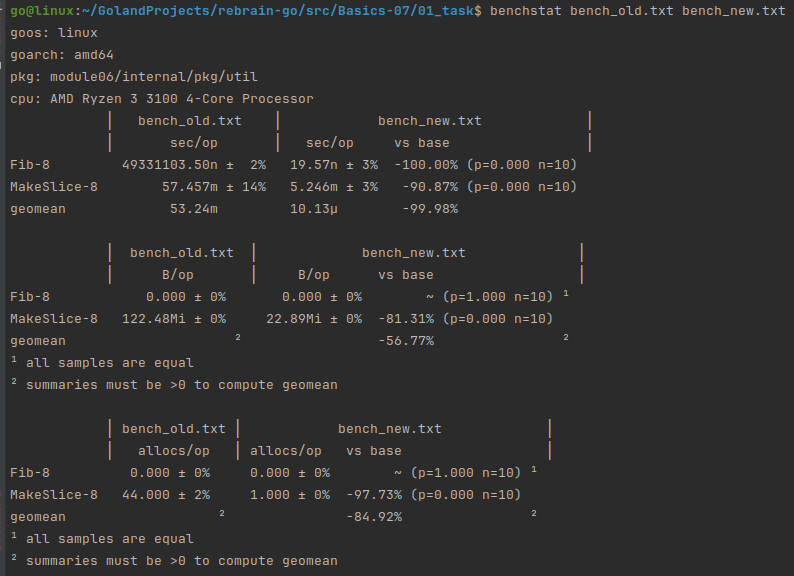

```text
go test -bench=. -benchtime=10s -benchmem ./internal/pkg/util | tee bench_old.txt
goos: linux
goarch: amd64
pkg: module06/internal/pkg/util
cpu: AMD Ryzen 3 3100 4-Core Processor              
BenchmarkFib-8               225          51896759 ns/op               0 B/op          0 allocs/op
BenchmarkMakeSlice-8         200          52728076 ns/op        128431802 B/op        57 allocs/op
PASS
ok      module06/internal/pkg/util      33.669s
```

```text
go test -bench=. -benchtime=10s -benchmem ./internal/pkg/util | tee bench_new.txt
goos: linux
goarch: amd64
pkg: module06/internal/pkg/util
cpu: AMD Ryzen 3 3100 4-Core Processor              
BenchmarkFib-8          621133245               20.04 ns/op            0 B/op          0 allocs/op
BenchmarkMakeSlice-8        2044           5731109 ns/op        24002611 B/op          3 allocs/op
PASS
ok      module06/internal/pkg/util      26.738s
```

```
go get -u golang.org/x/perf/cmd/benchstat
go install golang.org/x/perf/cmd/benchstat
```

```text
ll /usr/local/go/bin/
total 14952
drwxr-xr-x  2 root root     4096 мар 29  2024 ./
drwxr-xr-x 10 root root     4096 мар 29  2024 ../
-rwxr-xr-x  1 root root 12684603 мар 29  2024 go*
-rwxr-xr-x  1 root root  2610828 мар 29  2024 gofmt*

ll $GOPATH/bin
total 13656
drwxrwxrwx 2 go go     4096 мар 19 09:24 ./
drwxr-xr-x 9 go go     4096 мар 16 09:02 ../
-rwxrwxr-x 1 go go  3369634 мар 19 09:24 benchstat*        <------
-rwxrwxr-x 1 go go 10600033 мар 15 12:43 mockgen*
```

```text
benchstat bench_old.txt bench_new.txt
goos: linux
goarch: amd64
pkg: module06/internal/pkg/util
cpu: AMD Ryzen 3 3100 4-Core Processor              
            │   bench_old.txt    │             bench_new.txt             │
            │       sec/op       │    sec/op     vs base                 │
Fib-8         51896759.00n ± ∞ ¹   20.04n ± ∞ ¹        ~ (p=1.000 n=1) ²
MakeSlice-8        52.728m ± ∞ ¹   5.731m ± ∞ ¹        ~ (p=1.000 n=1) ²
geomean             52.31m         10.72µ        -99.98%
¹ need >= 6 samples for confidence interval at level 0.95
² need >= 4 samples to detect a difference at alpha level 0.05

            │ bench_old.txt  │             bench_new.txt              │
            │      B/op      │     B/op       vs base                 │
Fib-8            0.000 ± ∞ ¹     0.000 ± ∞ ¹        ~ (p=1.000 n=1) ²
MakeSlice-8   122.48Mi ± ∞ ¹   22.89Mi ± ∞ ¹        ~ (p=1.000 n=1) ³
geomean                    ⁴                  -56.77%               ⁴
¹ need >= 6 samples for confidence interval at level 0.95
² all samples are equal
³ need >= 4 samples to detect a difference at alpha level 0.05
⁴ summaries must be >0 to compute geomean

            │ bench_old.txt │            bench_new.txt             │
            │   allocs/op   │  allocs/op   vs base                 │
Fib-8           0.000 ± ∞ ¹   0.000 ± ∞ ¹        ~ (p=1.000 n=1) ²
MakeSlice-8    57.000 ± ∞ ¹   3.000 ± ∞ ¹        ~ (p=1.000 n=1) ³
geomean                   ⁴                -77.06%               ⁴
¹ need >= 6 samples for confidence interval at level 0.95
² all samples are equal
³ need >= 4 samples to detect a difference at alpha level 0.05
⁴ summaries must be >0 to compute geomean
```

```text
Fib:        51 ms → 0.00002 ms (20 ns)  - 2.5 million times faster
MakeSlice:  52 ms → 5.7 ms              - 9 times faster
MakeSlice:  122 MB → 22.9 MB            - 5 times better by memory
MakeSlice:  57 → 3                      - 19 times better by allocations
```

```text
rm bench_old.txt bench_new.txt

go test -bench=. -benchtime=1s -count=10 -benchmem ./internal/pkg/util > bench_old.txt
go test -bench=. -benchtime=1s -count=10 -benchmem ./internal/pkg/util > bench_new.txt
```

```text
benchstat bench_old.txt bench_new.txt
goos: linux
goarch: amd64
pkg: module06/internal/pkg/util
cpu: AMD Ryzen 3 3100 4-Core Processor              
            │   bench_old.txt    │            bench_new.txt             │
            │       sec/op       │   sec/op     vs base                 │
Fib-8         49331103.50n ±  2%   19.57n ± 3%  -100.00% (p=0.000 n=10)
MakeSlice-8        57.457m ± 14%   5.246m ± 3%   -90.87% (p=0.000 n=10)
geomean             53.24m         10.13µ        -99.98%

            │  bench_old.txt  │             bench_new.txt              │
            │      B/op       │     B/op      vs base                  │
Fib-8            0.000 ± 0%       0.000 ± 0%        ~ (p=1.000 n=10) ¹
MakeSlice-8   122.48Mi ± 0%     22.89Mi ± 0%  -81.31% (p=0.000 n=10)
geomean                     ²                 -56.77%                ²
¹ all samples are equal
² summaries must be >0 to compute geomean

            │ bench_old.txt │            bench_new.txt             │
            │   allocs/op   │ allocs/op   vs base                  │
Fib-8          0.000 ± 0%     0.000 ± 0%        ~ (p=1.000 n=10) ¹
MakeSlice-8   44.000 ± 2%     1.000 ± 0%  -97.73% (p=0.000 n=10)
geomean                   ²               -84.92%                ²
¹ all samples are equal
² summaries must be >0 to compute geomean
```



---

### Benchmark results for Fib and MakeSlice optimization:

`Fib:`
- Old: 49.33ms ± 2% → New: 19.57ns ± 3%  (-100.00%)

`MakeSlice:`
* Time:    57.46ms ± 14% → 5.246ms ± 3%   (-90.87%)
* Memory:  122.48MiB → 22.89MiB           (-81.31%)
* Allocs:  44.00 ± 2% → 1.00 ± 0%         (-97.73%)

Overall geomean improvement: -99.98% in time