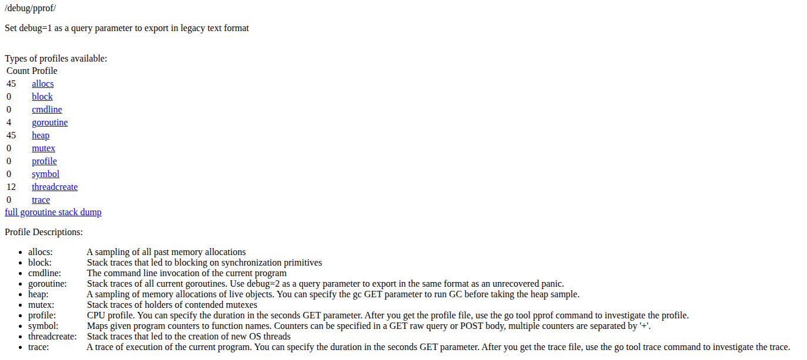
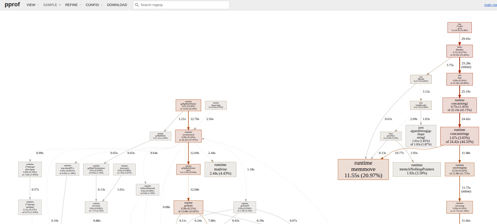
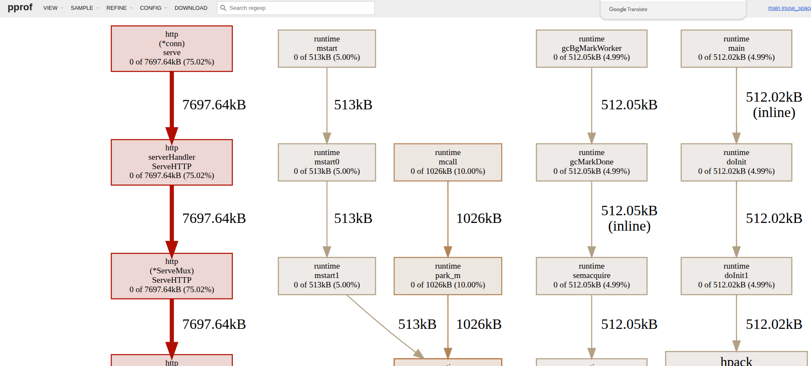
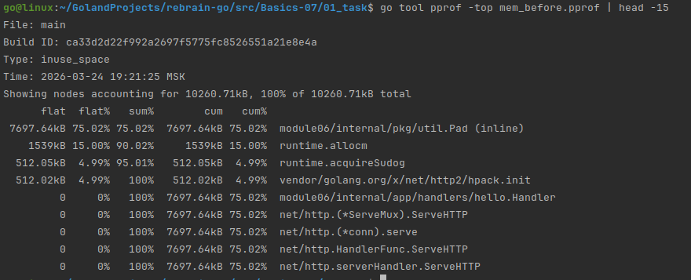
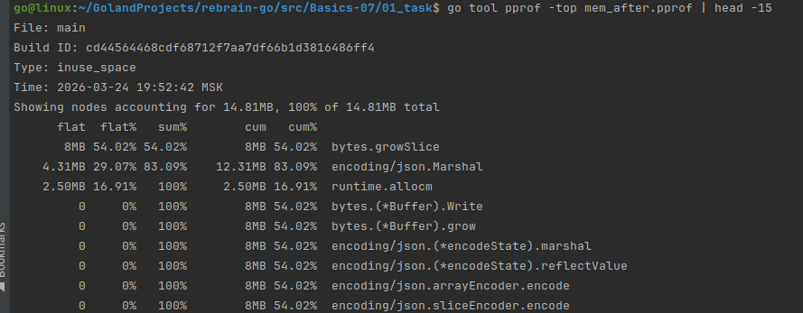
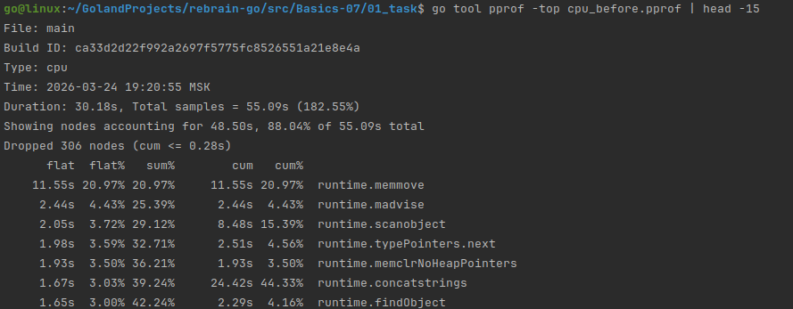
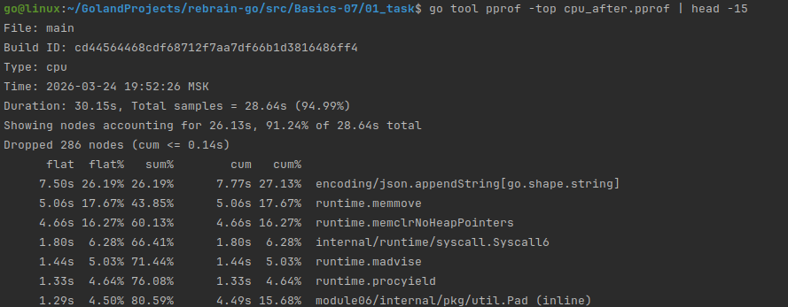

## Profiling

```go
import (
	_ "net/http/pprof"
)
```

```bash
go@linux:~/GolandProjects/rebrain-go/src/Basics-07/01_task$ go run ./cmd/app/main.go
```

http://localhost:9090/debug/pprof/



---

use the [Makefile](../01_task/Makefile)

Collecting CPU/mem profiles
```bash
make profile
```

Collecting CPU/mem profiles
```makefile
top-cpu:
	go tool pprof -top cpu_before.pprof | head -20
top-mem:
	go tool pprof -top mem_before.pprof | head -20
```

```text
File: main
Build ID: ca33d2d22f992a2697f5775fc8526551a21e8e4a
Type: cpu
Time: 2026-03-24 19:20:55 MSK
Duration: 30.18s, Total samples = 55.09s (182.55%)
Showing nodes accounting for 48.50s, 88.04% of 55.09s total
Dropped 306 nodes (cum <= 0.28s)
      flat  flat%   sum%        cum   cum%
    11.55s 20.97% 20.97%     11.55s 20.97%  runtime.memmove
     2.44s  4.43% 25.39%      2.44s  4.43%  runtime.madvise
     2.05s  3.72% 29.12%      8.48s 15.39%  runtime.scanobject
     1.98s  3.59% 32.71%      2.51s  4.56%  runtime.typePointers.next
     1.93s  3.50% 36.21%      1.93s  3.50%  runtime.memclrNoHeapPointers
     1.67s  3.03% 39.24%     24.42s 44.33%  runtime.concatstrings
     1.65s  3.00% 42.24%      2.29s  4.16%  runtime.findObject
     1.49s  2.70% 44.94%      3.83s  6.95%  runtime.(*sweepLocked).sweep
     1.40s  2.54% 47.49%      1.40s  2.54%  runtime.futex
     1.18s  2.14% 49.63%      1.18s  2.14%  runtime.procyield
     1.14s  2.07% 51.70%      1.14s  2.07%  runtime.(*sweepLocker).tryAcquire
     1.02s  1.85% 53.55%      1.02s  1.85%  internal/runtime/atomic.(*Uint32).Add (inline)
     
File: main
Build ID: ca33d2d22f992a2697f5775fc8526551a21e8e4a
Type: inuse_space
Time: 2026-03-24 19:21:25 MSK
Showing nodes accounting for 10260.71kB, 100% of 10260.71kB total
      flat  flat%   sum%        cum   cum%
 7697.64kB 75.02% 75.02%  7697.64kB 75.02%  module06/internal/pkg/util.Pad (inline)
    1539kB 15.00% 90.02%     1539kB 15.00%  runtime.allocm
  512.05kB  4.99% 95.01%   512.05kB  4.99%  runtime.acquireSudog
  512.02kB  4.99%   100%   512.02kB  4.99%  vendor/golang.org/x/net/http2/hpack.init
         0     0%   100%  7697.64kB 75.02%  module06/internal/app/handlers/hello.Handler
         0     0%   100%  7697.64kB 75.02%  net/http.(*ServeMux).ServeHTTP
         0     0%   100%  7697.64kB 75.02%  net/http.(*conn).serve
         0     0%   100%  7697.64kB 75.02%  net/http.HandlerFunc.ServeHTTP
         0     0%   100%  7697.64kB 75.02%  net/http.serverHandler.ServeHTTP
         0     0%   100%   512.02kB  4.99%  runtime.doInit (inline)
         0     0%   100%   512.02kB  4.99%  runtime.doInit1
         0     0%   100%   512.05kB  4.99%  runtime.gcBgMarkWorker
         0     0%   100%   512.05kB  4.99%  runtime.gcMarkDone
         0     0%   100%   512.02kB  4.99%  runtime.main
```


```bash
sudo apt-get install graphviz
####
analyze-cpu:
	go tool pprof -http=:8081 cpu_before.pprof

analyze-mem:
	go tool pprof -http=:8082 mem_before.pprof
```





---

## Change the function Pad()

```go
func Pad(s string, length int, template string) string {
    if template == "" || len(s) >= length {
    return s
    }
    
    // 1 allocation
    result := make([]byte, length)
    
    copy(result, s)
    
    tpl := []byte(template)
    tplLen := len(tpl)
    pos := len(s)
    
    for pos < length {
        n := copy(result[pos:], tpl)
        pos += n
    }

    return string(result)
}
```

```bash
go@linux:~/GolandProjects/rebrain-go/src/Basics-07/01_task$ ps aux | grep main.go
go        240027  0.0  0.1 1241916 21468 ?       Sl   19:20   0:00 go run ./cmd/app/main.go
go        251678  0.0  0.0   9228  2712 pts/1    S+   19:45   0:00 grep --color=auto main.go
go@linux:~/GolandProjects/rebrain-go/src/Basics-07/01_task$ kill 240027
go@linux:~/GolandProjects/rebrain-go/src/Basics-07/01_task$ lsof -i :9090
COMMAND    PID USER   FD   TYPE  DEVICE SIZE/OFF NODE NAME
main    240067   go    3u  IPv6 3039494      0t0  TCP *:9090 (LISTEN)
go@linux:~/GolandProjects/rebrain-go/src/Basics-07/01_task$ kill 240067
```

```bash
go run ./cmd/app/main.go
while true; do curl -s http://localhost:9090/hello > /dev/null; done
curl -o cpu_after.pprof http://localhost:9090/debug/pprof/profile?seconds=30
curl -o mem_after.pprof http://localhost:9090/debug/pprof/heap
```

```text
go tool pprof -top cpu_after.pprof | head -15
File: main
Build ID: cd44564468cdf68712f7aa7df66b1d3816486ff4
Type: cpu
Time: 2026-03-24 19:52:26 MSK
Duration: 30.15s, Total samples = 28.64s (94.99%)
Showing nodes accounting for 26.13s, 91.24% of 28.64s total
Dropped 286 nodes (cum <= 0.14s)
      flat  flat%   sum%        cum   cum%
     7.50s 26.19% 26.19%      7.77s 27.13%  encoding/json.appendString[go.shape.string]
     5.06s 17.67% 43.85%      5.06s 17.67%  runtime.memmove
     4.66s 16.27% 60.13%      4.66s 16.27%  runtime.memclrNoHeapPointers
     1.80s  6.28% 66.41%      1.80s  6.28%  internal/runtime/syscall.Syscall6
     1.44s  5.03% 71.44%      1.44s  5.03%  runtime.madvise
     1.33s  4.64% 76.08%      1.33s  4.64%  runtime.procyield
     1.29s  4.50% 80.59%      4.49s 15.68%  module06/internal/pkg/util.Pad (inline)
     
go tool pprof -top mem_after.pprof | head -15
File: main
Build ID: cd44564468cdf68712f7aa7df66b1d3816486ff4
Type: inuse_space
Time: 2026-03-24 19:52:42 MSK
Showing nodes accounting for 14.81MB, 100% of 14.81MB total
      flat  flat%   sum%        cum   cum%
       8MB 54.02% 54.02%        8MB 54.02%  bytes.growSlice
    4.31MB 29.07% 83.09%    12.31MB 83.09%  encoding/json.Marshal
    2.50MB 16.91%   100%     2.50MB 16.91%  runtime.allocm
         0     0%   100%        8MB 54.02%  bytes.(*Buffer).Write
         0     0%   100%        8MB 54.02%  bytes.(*Buffer).grow
         0     0%   100%        8MB 54.02%  encoding/json.(*encodeState).marshal
         0     0%   100%        8MB 54.02%  encoding/json.(*encodeState).reflectValue
         0     0%   100%        8MB 54.02%  encoding/json.arrayEncoder.encode
         0     0%   100%        8MB 54.02%  encoding/json.sliceEncoder.encode
```

---

## Comparison

```bash
go tool pprof -top mem_before.pprof | head -15
go tool pprof -top mem_after.pprof | head -15
go tool pprof -top cpu_before.pprof | head -15
go tool pprof -top cpu_after.pprof | head -15
```









---

## Performance Optimization Results

### Memory Profile Comparison

| Metric              | Before        | After         | Change    |
|---------------------|---------------|---------------|-----------|
| **Total Memory**    | 10.26 MB      | 14.81 MB      | +44%      |
| **util.Pad Memory** | 7.70 MB (75%) | 0 MB          | **-100%** |
| **Main Allocator**  | util.Pad      | encoding/json |           |

### CPU Profile Comparison (30 seconds)

| Metric              | Before | After  | Improvement |
|---------------------|--------|--------|-------------|
| **Total CPU Time**  | 55.09s | 28.64s | **-48%**    |
| **CPU Utilization** | 182%   | 95%    | **-87%**    |

1. `util.Pad` eliminated from memory profile
2. CPU consumption reduced by half
3. JSON marshaling became the new bottleneck
4. Memory increase is acceptable - traded memory for CPU efficiency
