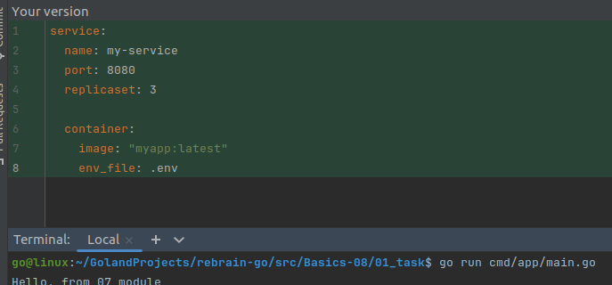

## Useful links

* [Variables](https://pkg.go.dev/text/template#hdr-Variables)
* [Go templates made easy](https://blog.jetbrains.com/go/2018/12/14/go-templates-made-easy/?gclid=Cj0KCQjwg8n5BRCdARIsALxKb95_GLLIvD2L0Rz4Fgi2W6TrQdGPdLdBaKLUr7EUei78k22TOFJJovkaAsNSEALw_wcB)
* [Go text/template docs](https://golang.org/pkg/text/template/#hdr-Variables)
* [Yaml validator](http://www.yamllint.com/)

## Task

