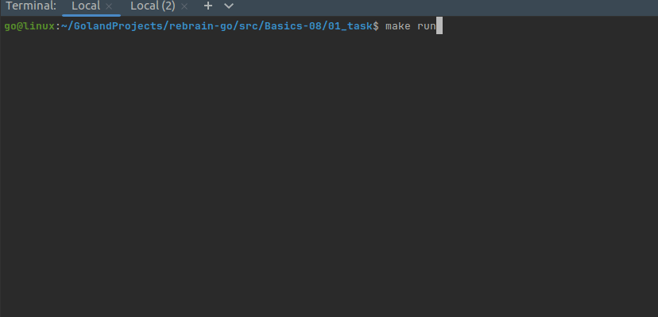

## Install gowrap

````bash
go install github.com/hexdigest/gowrap/cmd/gowrap@latest
````

Check it works:

```bash
gowrap help
```

## Create the generated wrappers package and templates directory

```bash
mkdir -p internal/generated/wrappers
mkdir -p internal/templates
touch internal/generated/wrappers/generate.go
```

## Create custom template: panic recovery

[recovery.tmpl](../01_task/internal/templates/recovery.tmpl)

## Fill wrappers

[`internal/generated/wrappers/generate.go`](../01_task/internal/generated/wrappers/generate.go)

```go
package wrappers

//go:generate gowrap gen -p module07/internal/monitors -i Monitor -t log -o ./monitor_with_log.go
//go:generate gowrap gen -p module07/internal/monitors -i Monitor -t prometheus -o ./monitor_with_metrics.go
//go:generate gowrap gen -p module07/internal/monitors -i Monitor -t ./internal/templates/recovery.tmpl -o ./monitor_with_recovery.go
```

where:
- `-p` = package
- `-i` - interface
- `-t` - template
- `-o` - file to save wrapper

## Get dependencies

```go
go get github.com/prometheus/client_golang/prometheus
go get github.com/prometheus/client_golang/prometheus/promauto
go get github.com/prometheus/client_golang/prometheus/promhttp
go mod tidy
```

## Generate wrappers

```bash
make generate

Generating wrappers...
Done!
```

Result: 
- [monitor_with_log.go](../01_task/internal/generated/wrappers/monitor_with_log.go)
- [monitor_with_metrics.go](../01_task/internal/generated/wrappers/monitor_with_metrics.go)
- [monitor_with_recovery.go](../01_task/internal/generated/wrappers/monitor_with_recovery.go)

## Modify main()

- [panic_monitor.go](../01_task/internal/monitors/panic_monitor.go) created
- server added
- custom wrapper test added
- default wrappers (log & metrics) checked

## Run

```go
make run
```

