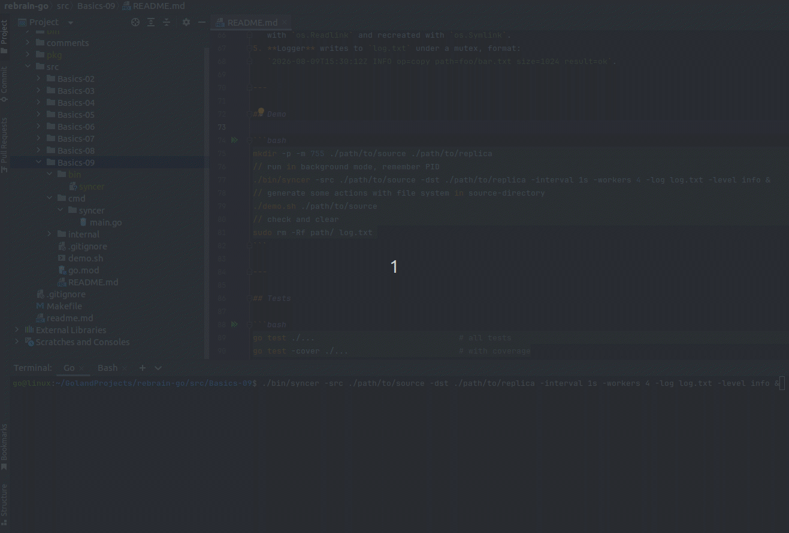

# syncer — final project (Basics-09)

Daemon utility that keeps a replica directory in sync with a source directory.
Periodically walks both trees, compares snapshots and applies operations
(create / copy / delete / chmod). Symbolic links are copied as-is (not
dereferenced).

## Task

Implement an application that takes two directory paths (source and replica)
and synchronizes them. Full sync: adding or removing a file in the source is
mirrored in the replica; permissions are mirrored where the OS allows.

### Constraints

- Runs in the background (long-running process).
- Uses goroutines.
- `context` is mandatory (cancellation, graceful shutdown).
- `sync` package is required (`WaitGroup`, `Mutex`).
- No third-party concurrency libraries — only `sync` and `context`.
- Logs to `log.txt` (timestamp, operation type, size, path, level).
- Unit tests for the main functions + benchmarks for copy.

## Usage

```bash
# build
go build -o bin/syncer ./cmd/syncer

# run
./bin/syncer -src /path/to/source -dst /path/to/replica \
             -interval 5s -workers 4 -log log.txt -level info
```

Flags:

| Flag         | Default    | Description                                       |
|--------------|------------|---------------------------------------------------|
| `-src`       | (required) | source directory                                  |
| `-dst`       | (required) | replica directory (created if missing)            |
| `-interval`  | `5s`       | reconciliation period                             |
| `-workers`   | `4`        | worker-pool size                                  |
| `-log`       | `log.txt`  | log file path                                     |
| `-level`     | `info`     | level: `debug` \| `info` \| `error`               |

Stop with `Ctrl+C` (SIGINT/SIGTERM): in-flight operations finish, the process
exits cleanly via context cancellation.

## How it works

A file is considered changed if its size or mtime differ.

1. **Scanner** walks the tree (`filepath.WalkDir` + `os.Lstat`) and builds a
   `map[relPath]Entry{Mode, Size, ModTime, IsDir, IsSymlink, LinkTarget}`.
2. **Differ** compares the source and replica snapshots and returns an
   ordered list of operations:
   - `mkdir` — parents before children;
   - `copy` / `symlink` — files themselves;
   - `chmod` — permission fixes;
   - `delete` — children before parents.
3. **Syncer** invokes scan → diff on each `time.Ticker` tick and dispatches
   operations to a fixed pool of worker goroutines (`sync.WaitGroup`).
4. **Fsops** copies atomically: writes to a temp file in the target directory
   and `os.Rename`s over the destination. Permissions come from `os.Chmod`,
   mtime from `os.Chtimes`. Symlinks are not dereferenced: the target is read
   with `os.Readlink` and recreated with `os.Symlink`.
5. **Logger** writes to `log.txt` under a mutex, format:
   `2026-08-09T15:30:12Z INFO op=copy path=foo/bar.txt size=1024 result=ok`.

---

## Demo

```bash
mkdir -p -m 755 ./path/to/source ./path/to/replica
// run in background mode, remember PID
./bin/syncer -src ./path/to/source -dst ./path/to/replica -interval 1s -workers 4 -log log.txt -level info &
// generate some actions with file system in source-directory
./demo.sh ./path/to/source
// check and clear
sudo rm -Rf path/ log.txt 
```

**Some lags because of IDE:**


---

## Tests

```bash
go test ./...                              # all tests
go test -cover ./...                       # with coverage
```

```bash
ok      syncer/internal/differ  0.006s  coverage: 80.4% of statements
ok      syncer/internal/fsops   0.016s  coverage: 69.2% of statements
ok      syncer/internal/logger  0.009s  coverage: 70.8% of statements
ok      syncer/internal/scanner 0.005s  coverage: 84.6% of statements
ok      syncer/internal/syncer  0.073s  coverage: 74.2% of statements
```

```bash
go test -bench=. ./internal/fsops          # copy benchmarks
```

```bash
goos: linux
goarch: amd64
pkg: syncer/internal/fsops
cpu: AMD Ryzen 3 3100 4-Core Processor              
BenchmarkCopyFile1KB-8               604           4656688 ns/op           0.22 MB/s
BenchmarkCopyFile1MB-8                 8         240594896 ns/op           4.36 MB/s
BenchmarkCopyFile10MB-8               37         430604190 ns/op          24.35 MB/s
PASS
ok      syncer/internal/fsops   21.229s
```